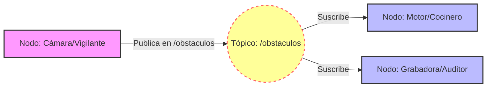

# Diagramas

```mermaid
graph LR
  A[Nodo: Cámara/Vigilante] -- Publica en /obstaculos --> B((Tópico: /obstaculos))
  B -- Suscribe --> C[Nodo: Motor/Cocinero]
  B -- Suscribe --> D[Nodo: Grabadora/Auditor]

  %% Estilos de nodos
  style A fill:#f9f,stroke:#333,stroke-width:2px
  style C fill:#bbf,stroke:#333,stroke-width:2px
  style D fill:#bbf,stroke:#333,stroke-width:2px

  %% Estilo del tópico (nodo en borde)
  style B fill:#ff9,stroke:#f66,stroke-width:2px,stroke-dasharray: 5 5
```
