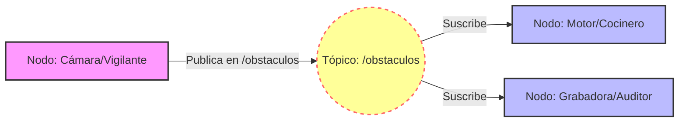

# Diagramas


```mermaid  
flowchart TD  
    subgraph RubikPi["SBC Rubik Pi 3"]  
        direction TB  
        RT["Ubuntu PREEMPT_RT Kernel"]  
        GUI["Algoritmo Python GUI"]  
        RT --- GUI  
    end  

    subgraph IRC5["Controlador IRC5"]  
        SOCK["Servidor Socket RAPID"]  
    end  

    subgraph YUMI["Robot ABB YuMi IRB 14000"]  
        ACT["Actuadores y Sensores"]  
    end  

    GUI -->|"RJ45 Gigabit Ethernet (Socket TCP/IP)"| SOCK  
    SOCK -->|"Buses de Campo Internos"| ACT  
    ACT -->|"Retroalimentación (posición, fuerza, estado)"| SOCK  
    SOCK -->|"Respuestas y datos"| GUI  
```

    B <-->|"① Comandos y datos%%BR%%② Ethernet RJ45 GbE"| D
    D <-->|"③ Instrucciones internas%%BR%%④ Buses de campo"| E
    E -.->|"⑤ Retroalimentación%%BR%%en tiempo real"| D
    D -.->|"⑥ Actualización de estado"| B
