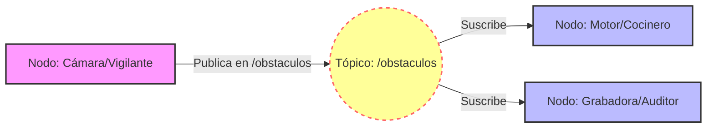

# Diagramas

flowchart LR
    subgraph N1["Capa 1: Computación"]
        A["Rubik Pi 3 <small>Ubuntu PREEMPT_RT</small>"]
        B["Algoritmo Python Interfaz Gráfica"]
    end

    subgraph N2["Capa 2: Control"]
        C["Controlador IRC5"]
        D["Servidor Socket RAPID"]
    end

    subgraph N3["Capa 3: Actuación"]
        E["Robot ABB YuMi IRB 14000"]
    end

    B <-->|"① Comandos y datos%%BR%%② Ethernet RJ45 GbE"| D
    D <-->|"③ Instrucciones internas%%BR%%④ Buses de campo"| E
    E -.->|"⑤ Retroalimentación%%BR%%en tiempo real"| D
    D -.->|"⑥ Actualización de estado"| B
