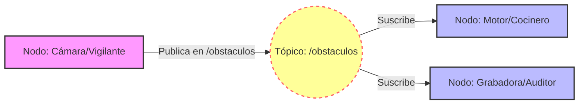

# Diagramas


```mermaid
graph TD
    %% Definición de estilos
    classDef proceso fill:#bbdefb,stroke:#0d47a1,stroke-width:2px,color:black;
    classDef decision fill:#ffe0b2,stroke:#e65100,stroke-width:2px,color:black;
    classDef final fill:#d1c4e9,stroke:#4527a0,stroke-width:2px,color:black;
    classDef callback fill:#c8e6c9,stroke:#1b5e20,stroke-width:2px,stroke-dasharray: 5 5,color:black;

    %% Nodos
    A[Configurar entorno e importar librerías]:::proceso
    B[Instanciar y configurar el suscriptor requerido]:::proceso
    
    C{¿Escucha<br>algo?}:::decision
    
    subgraph "Función Callback"
        D[Registrar mensaje recibido<br>e imprimir en pantalla]:::callback
    end
    
    E[Esperar a ejecutar de nuevo<br>(spin)]:::final
    F{¿Interrupción<br>Externa?}:::decision
    G[Terminar el Programa<br>y Destruir Nodos]:::final

    %% Conexiones
    A --> B
    B --> C
    C -- Sí --> D
    D --> E
    C -- No --> E
    E --> F
    F -- No --> C
    F -- Sí --> G

```
