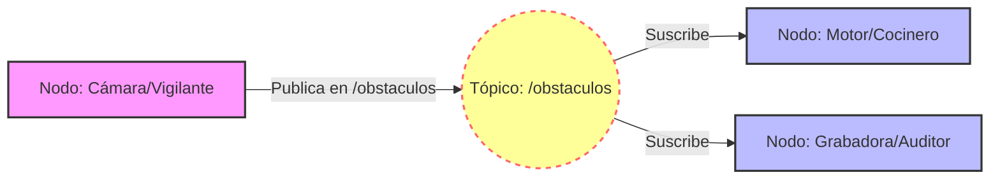
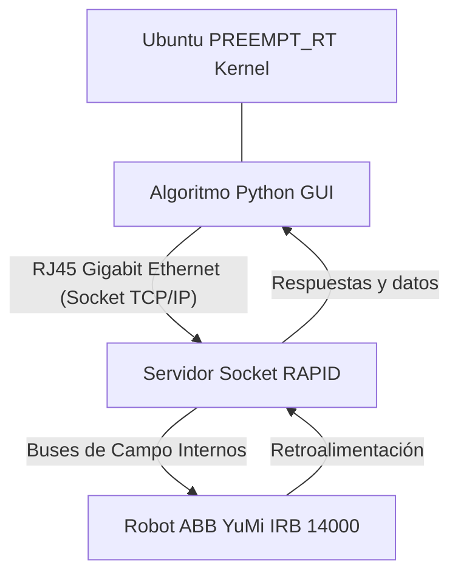
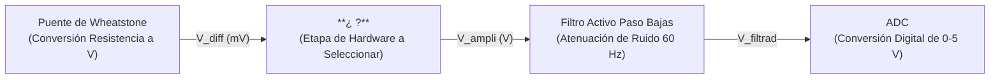
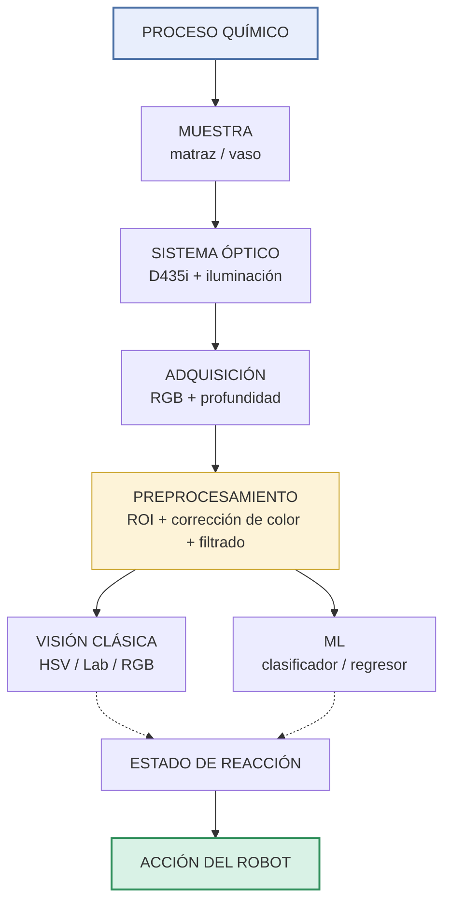

# Diagramas

```mermaid
graph LR
  A[Nodo: Cámara/Vigilante] -- Publica en /obstaculos --> B((Tópico: /obstaculos))
  B -- Suscribe --> C[Nodo: Motor/Cocinero]
  B -- Suscribe --> D[Nodo: Grabadora/Auditor]

  %% Estilos de nodos
  style A fill:#f9f,stroke:#333,stroke-width:2px
  style C fill:#bbf,stroke:#333,stroke-width:2px
  style D fill:#bbf,stroke:#333,stroke-width:2px

  %% Estilo del tópico (nodo en borde)
  style B fill:#ff9,stroke:#f66,stroke-width:2px,stroke-dasharray: 5 5
```

```mermaid  
flowchart TD  
    RT["Ubuntu PREEMPT_RT Kernel"] --- GUI["Algoritmo Python GUI"]  
    GUI -->|"RJ45 Gigabit Ethernet (Socket TCP/IP)"| SOCK["Servidor Socket RAPID"]  
    SOCK -->|"Buses de Campo Internos"| ACT["Robot ABB YuMi IRB 14000"]  

    ACT -->|"Retroalimentación"| SOCK  
    SOCK -->|"Respuestas y datos"| GUI  

```

```mermaid  
flowchart LR
    A["Puente de Wheatstone
(Conversión Resistencia a V)"] --V_diff (mV)--> B
    B["**¿ ?**
(Etapa de Hardware a Seleccionar)"] --V_ampli (V)--> C
    C["Filtro Activo Paso Bajas
(Atenuación de Ruido 60 Hz)"] --V_filtrado--> D
    D["ADC
(Conversión Digital de 0-5 V)"]

```

```mermaid  
flowchart TD
    A[PROCESO QUÍMICO] --> B[MUESTRA<br/>matraz / vaso]
    B --> C["SISTEMA ÓPTICO<br/>D435i + iluminación"]
    C --> D["ADQUISICIÓN<br/>RGB + profundidad"]
    D --> E["PREPROCESAMIENTO<br/>ROI + corrección de color + filtrado"]

    E --> F["VISIÓN CLÁSICA<br/>HSV / Lab / RGB"]
    E --> G["ML<br/>clasificador / regresor"]

    F -.-> I[ESTADO DE REACCIÓN]
    G -.-> I

    I --> J[ACCIÓN DEL ROBOT]

    style A fill:#e8eefc,stroke:#4a6fa5,stroke-width:2px
    style E fill:#fdf3d8,stroke:#c9a227
    style J fill:#d9f2e6,stroke:#2f8f5b,stroke-width:2px

```
